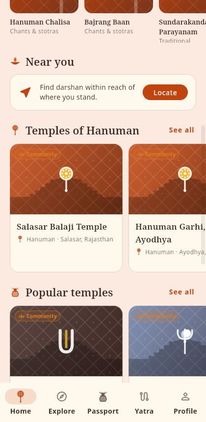
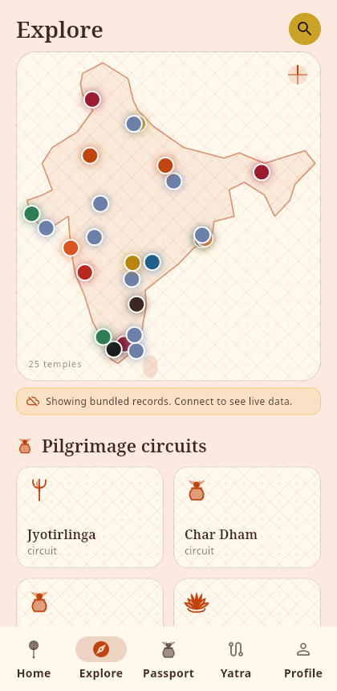
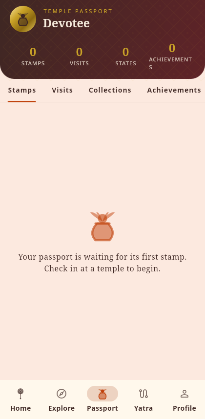
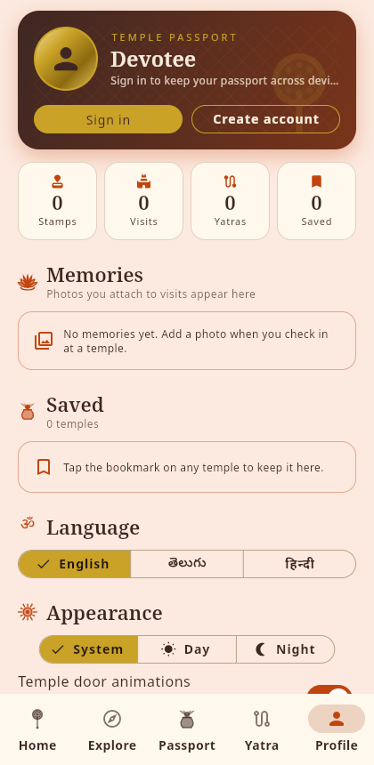
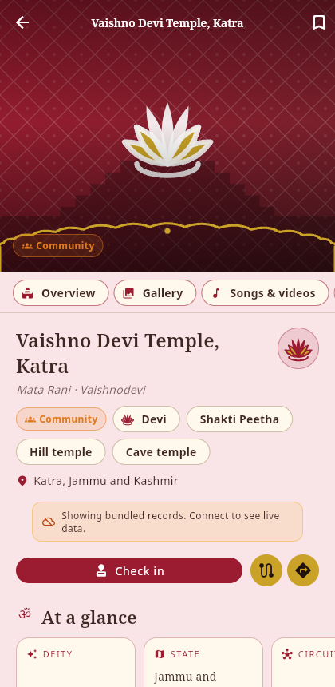
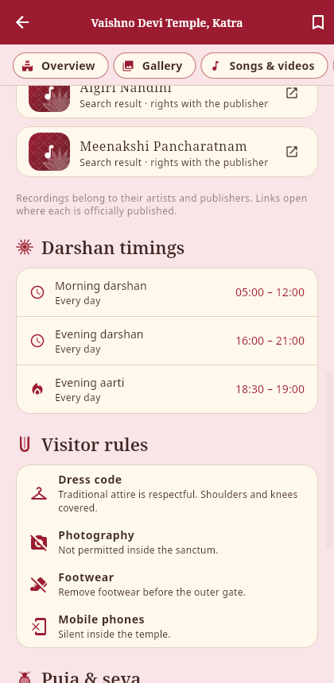

# Temple App — Flutter Client

Flutter client for the temple pilgrimage platform (working name:
**Temple Passport** — not finalised). One codebase targets **Android, iOS and
Flutter Web**.

The backend API and admin panel live in
[`temple-website`](https://github.com/PranayReddy10/temple-website); this app
talks to it only through `/api/v1`.

See **[ROADMAP.md](ROADMAP.md)** for the feature slices and delivery order.

## Status — Phase 1 complete

Every Phase 3 slice of the product roadmap (the Flutter phase) has a first
working version:

| Feature | Where |
| --- | --- |
| Temple design system, light and dark, tinted per weekday deity | `core/theme/` |
| Opening temple doors on every "enter" (temple, day, yatra) and on launch | `core/widgets/temple_door.dart` |
| Five tabs: Home, Explore, Passport, Yatra, Profile | `features/shell/` |
| Home: today's deity, mantra, week strip, nearby, popular, festivals | `features/home/` |
| Day pages: one sanctum per weekday with mantra, offering, vrat, media, temples | `features/days/` |
| Explore: lamp map of India, circuits, deities, states, search with filters and nearby | `features/explore/` |
| Temple profile: hero gallery with viewer, section anchors, at-a-glance facts, deity mantra, songs, chants and videos, timings, closures, events, pujas, facilities, rules, contact, trust | `features/temple/` |
| Songs, chants and darshan videos per deity, on Home, on each day page and on every temple | `core/data/sample_media.dart`, `core/widgets/media_widgets.dart` |
| Passport: stamps, visits, circuit collections, achievements, manual check-in | `features/passport/` |
| Photo Stamp: memory card with the passport stamp, share sheet | `features/photo_stamp/` |
| Favourites and Yatra planner: days, stops, reorder, Yatra mode, route in Maps | `features/yatra/` |
| Devotee accounts against `/api/v1/auth` and `/api/v1/me` | `features/auth/` |
| Complete profile: photo, name, email, phone, home state, date of birth, language; memories gallery; saved temples as cards | `features/profile/` |
| English, Telugu and Hindi interface strings | `core/l10n/` |

Works with **no backend**: when the API is unreachable the app falls back to
the bundled sample set (the same records the backend seeds) and says so on
screen. Sample records are all community level; nothing bundled is ever shown
as verified.

## Not yet wired to the backend

The app and its backend were built in parallel, so some of what works here
works on the device against endpoints that now exist. None of it is broken —
the app has to keep working with no signal at a temple gate — but these are
the joins still to make:

| In the app | Endpoint waiting for it |
| --- | --- |
| Passport visits and stamps, kept on the device | `GET /me/passport`, `GET /me/visits`, `POST /temples/{slug}/visits` |
| Photo Stamp cards, composed and shared locally | `POST /temples/{slug}/photos` — keeps the original and the card as separate files, and moderates before anyone else sees either |
| Yatra itineraries, kept on the device | `GET|POST /me/yatras`, `PUT /me/yatras/{id}/temples/{slug}` |
| Interface strings bundled in three languages | `GET /api/v1/languages`, and `?lang=` on every read endpoint for translated temple content |
| — | `GET|POST /me/memories`: a devotee's own writing about a visit, private by default |

Two rules the backend enforces that the client has to respect when syncing:

- A **manual check-in never counts as a stamp**, whatever coordinates it
  sends. Only a GPS or QR check-in within the radius verifies itself. The app
  should show recorded-but-unverified visits differently from stamps.
- A **private memory stays private** through a `PATCH` that omits the field,
  and an uploaded photo is not visible to anyone else until it is both
  approved and shared.

Send `X-Platform` and `X-App-Version` on requests — they are recorded against
each sign-in and are what the admin's analytics screen reads.

Full request and response detail is in
[`temple-website/docs/API.md`](https://github.com/PranayReddy10/temple-website/blob/main/docs/API.md).

## Running

```
flutter pub get
flutter run                               # a connected device or emulator
flutter run -d chrome                     # web
flutter run --dart-define=API_BASE_URL=https://your-server.example
```

The API server can also be changed at runtime from **Profile → Server**.
Brand name and tagline come from `--dart-define=BRAND_NAME=…` and
`BRAND_TAGLINE=…`, mirroring `config/brand.php` on the backend.

```
flutter analyze
flutter test
flutter build web --release
```

## The day themes

Every screen is tinted by the day's deity. The mapping is the traditional one
the backend seeds, so the app and the admin dashboard agree:

| Day | Deity | Accent | Motif |
| --- | --- | --- | --- |
| Sunday | Surya | saffron | sun |
| Monday | Shiva | vibhuti ash-blue | trishul and crescent |
| Tuesday | Hanuman | sindoor | gada |
| Wednesday | Krishna | peacock green | feather and flute |
| Thursday | Vishnu | turmeric gold | shankha and chakra |
| Friday | Devi | kumkum | lotus |
| Saturday | Venkateswara | deep teak | namam |

When the API is live, the lead deity's accent for today comes from the
`/api/v1/today` response so editors can tune it without an app release. The
motifs, greetings, offerings and vrat notes are in `core/theme/day_theme.dart`.

Motifs, the gopuram skyline, kolam dividers, the torana arch, the carved
doors and the passport stamp are all `CustomPainter`s: no image assets, any
size, any colour.

## Two API contracts the UI honours

From `docs/API.md` in the backend, because getting them wrong misleads a
devotee:

1. **An unpriced puja is not a free puja.** The fee label is rendered
   verbatim; `amount: null` is shown as "No published price", never "Free".
2. **Only `booking.is_official` may be presented as official.** Any other
   link is shown as a plain link with the label the API supplies.

Trust levels (official, verified, community, unverified) stay visually
distinct on every card and profile.

## Structure

```
lib/
├── core/
│   ├── api/          # ApiClient, TempleRepository (live + offline fallback)
│   ├── data/         # Bundled sample records
│   ├── l10n/         # EN / TE / HI strings
│   ├── models/       # v1 resource models
│   ├── motifs/       # Deity motifs and temple architecture painters
│   ├── state/        # Settings, auth, day theme, passport, favourites, yatra
│   ├── theme/        # Palette, DayTheme, AppTheme
│   └── widgets/      # Temple door, cards, badges, dividers, loaders
├── features/
│   ├── splash/  home/  days/  explore/  temple/
│   ├── passport/  photo_stamp/  yatra/  profile/  auth/  shell/
└── main.dart
```

## Media and rights

Recordings are copyrighted even when the composition is centuries old. The
bundled catalogue therefore never links to a specific upload: each song,
chant or video opens a search on the platform where it is officially
published, and the rights line says so. When the API publishes media for a
day (with the licence and credit the schema requires), the app shows that
instead. Gallery photos from the API carry their credit and licence into the
viewer.

## Fonts

Noto Serif, Noto Sans, Noto Sans Devanagari and Noto Sans Telugu are bundled
under the SIL Open Font License 1.1 so mantras and Indic interface text render
on every platform without a network fetch.

## Screenshots

Captured from the web build with no backend attached (bundled records).

| Doors | Home | Explore |
| --- | --- | --- |
|  |  |  |

| Passport | Yatra | Profile |
| --- | --- | --- |
|  |  |  |

| Temple | Songs & videos |
| --- | --- |
|  |  |
